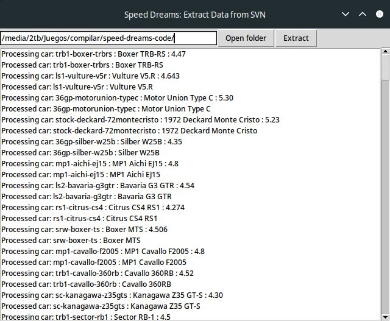

# Speed Dreams Webserver

A webserver for [Speed-Dreams](https://speed-dreams.net)

This server stores the statistics of each race of the registered players. 

Along each page you will be able to see the statistics of each player: his races, personal bests in each race, track and car information, the time he made within the game, lap statistics, etc.

## Installation

### Requirements
To run the server you will need a web server with PHP and a MySQL or MariaDB database installed.

* Download the code or clone the repository.
* You have to edit 2 files before uploading to the server:
  * app/Config/App.php: In this file it is only necessary to change the value of the variable $baseURL by the URL where the server will be (for example https://myweb.com/sdwebserver).
  * app/Config/Database.php: here is the configuration of the database connection. You only have to modify the ones inside the $default array.
* It is necessary to obtain the data of the current cars and tracks of the game. To do this you need to run the Python script **extractdatafromsvn.py**. By default it will open a simple interface, or you can pass as a parameter the path to where the game code is located

* Finally you must create the necessary tables. Inside **sdwebserver.sql** you will find the statements to create them. Sole you must import it from PhpMyAdmin or any other application you use (or your hosting provider uses).

Once you have followed these steps you only have to upload all the content to your web hosting and it will be ready to work.

Translated with www.DeepL.com/Translator (free version)